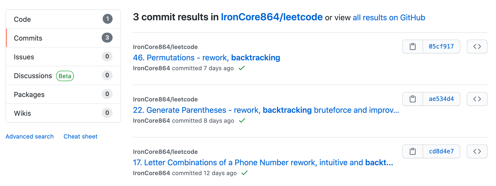

# My LeetCode Collections

*Note: this repo doesn't code style conventions because leet code requires specific names for functions, for example, `countBits`, instead of `count_bits`. To make things easier to maintain, I kept the original parameter names from LeetCode.*

## Origin and History

This is my LeetCode project which I started at the end of 2016.

I continued for quite a while, stopped in the mid of 2018, hibernated for quite a long time.

At the end of 2020 but didn't keep it going for a long time.

Refer to this [timeline](https://github.com/IronCore864/leetcode/graphs/contributors).

## Programming Languages

Originally, I started with Python2.

Later, some are done in Python3.

To keep my Golang skills sharp when I didn't use Golang at work, I reworked some solutions in Go as well.

I might rework some in Rust in the future but at the moment there isn't any yet as of early 2021.

## Dir Structure

Initially, I put every problem as a single file in the above folders:

- folder `0`: questions 0-99
- folder `1`: questions 1-199
- folder `2`: questions 2-299
- ...

## Rework (Mainly in Python3)

In the spring of 2021, I decided to rework it a bit, mainly focusing on the medium difficulty, top interviewed ones.

I didn't plan to rework ALL of those medium difficulty ones, though. 

Each of the reworked new solutions has its own single commit, with comments at least, possibly a readme as well, and put under specific folders with the problem name.

## Search

Search in this repo (see results in both code, and commits) to find a specific topic or algorithm. For example, if you want to see problems related to "backtrack":

